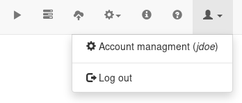

# AskOmics tutorial

## User account

### Account creation

To use AskOmics, you will need an account. Go to the signup page by clicking to the login tab.

Then, click to the signup link.

fill the form with the requested information.

### Account management

To manage your account, use the account management tab.

#### Update information

This section allow you to change your email address and your password.

#### API key

the API key ensures the connection of AskOmics with third-party applications (like Galaxy).

Updating the API key will revoke existing accesses.

#### Galaxy account

Link a Galaxy account to use Galaxy datasets into AskOmics.

#### Account deletion

The account deletion is final, all your information, as well as all your data will be deleted.

## Use case 1: Gene expression

All files needed for the tutorial are available [here](https://github.com/askomics/demo-data/tree/master/Tutorials/Tuto1)

3 files are provided:

- gene.tsv: Gene location on a genome
- orthogroup.tsv: group of ortholog genes
- differential_expression.tsv: results of differential expression experiences

### Files organization

AskOmics take as inputs CSV files. But these files have to respect a certain structure.

A CSV file describe an **entity**. The entity name is displayed in the first header on the file. Entity name of the file `gene.tsv` is *Gene*.

Other headers describe the entity **attributes** and **relations**. An attributes is a simple columns one a file. For example, *Gene* have 5 attributes: *organism*, *chromosome*, *strand*, *start* and *end*. A relation is described by a header like *relation_name@entity*. On the `orthogroup.tsv` file, *Orthogroup* entity have a *concerns* relation. This relation target the *Gene* entity.

### Upload files

First step is to upload your CSV files into AskOmics. Click on the *upload* tab to go to the upload page.

On the upload page, use the *Upload* button, and add files into the upload queue. Then, start uploading the files.

The CSV files are now uploaded on AskOmics.

### Integrate files

On the upload page, select the file to integrate, and click to the *Integrate* button. AskOmics shows an overview of the file.

1. Columns disabler: ucheck columns to ignore them
2. Header updater: optionally update entity or attribute names
3. Key columns: check several columns to create a new one by concatenate the columns checked
4. Entity type: choose between simple entity or entity start (default). An entity start will be displayed one the startpoint page.
5. Attributes types: select the attributes types (see bellow)
6. Custom URI: update the attributes URI (advanced feature)

Attributes can be one of the following types:

- Attributes
    * Numeric
    * Text
    * Category
    * Date/time
- Positionable attributes
    * Taxon
    * Chromosome
    * Strand
    * Start
    * End
- Relation
    * General relation to entity
    * Symmetric relation to entity

Types are automatically detected by AskOmics, but you can override them if needed.

### Interrogate datasets

### Download the results

## Use AskOmics with Galaxy

### Connect Galaxy into AskOmics

### Upload Galaxy datasets into AskOmics

### Save query state into Galaxy history

### Save query results into Galaxy history

